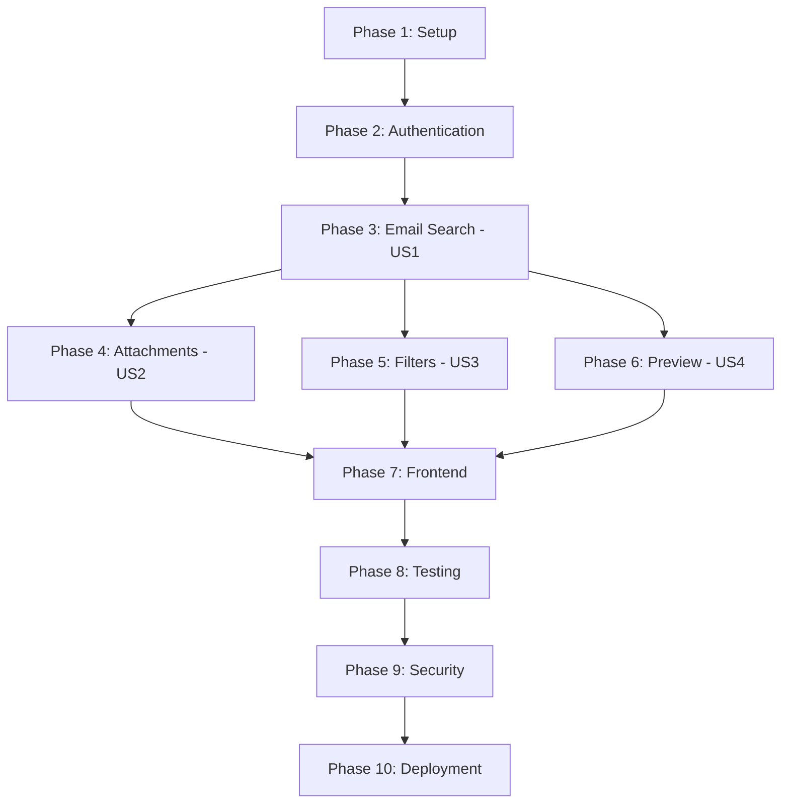

# Implementation Tasks: Gmail Email Search & CV Extraction

**Feature**: 004-gmail-email-search
**Branch**: `004-gmail-email-search`
**Created**: 2025-11-03
**Total Tasks**: 87

## Task Status Legend
- `[ ]` Not Started
- `[→]` In Progress
- `[✓]` Completed
- `[⊗]` Blocked

---

## Phase 1: Setup & Infrastructure (14 tasks)

### Project Initialization

- [ ] [T-001] [P1] [Setup] Create backend gmail-service directory structure → `backend/services/gmail-service/`
- [ ] [T-002] [P1] [Setup] Initialize NestJS application with TypeScript → `backend/services/gmail-service/package.json`
- [ ] [T-003] [P1] [Setup] Install core dependencies (NestJS, Prisma, googleapis, passport) → `backend/services/gmail-service/package.json`
- [ ] [T-004] [P1] [Setup] Configure TypeScript for strict mode → `backend/services/gmail-service/tsconfig.json`
- [ ] [T-005] [P1] [Setup] Create environment configuration template → `backend/services/gmail-service/.env.example`
- [ ] [T-006] [P1] [Setup] Initialize frontend Next.js 14 application → `frontend/package.json`
- [ ] [T-007] [P1] [Setup] Install frontend dependencies (React Query, Axios, Tailwind) → `frontend/package.json`

### Database & Infrastructure

- [ ] [T-008] [P1] [Setup] Initialize Prisma ORM → `backend/services/gmail-service/prisma/schema.prisma`
- [ ] [T-009] [P1] [Setup] Create Prisma schema with 7 entities → `backend/services/gmail-service/prisma/schema.prisma`
- [ ] [T-010] [P1] [Setup] Create initial database migration → `backend/services/gmail-service/prisma/migrations/`
- [ ] [T-011] [P1] [Setup] Configure Redis connection for sessions/cache → `backend/services/gmail-service/src/config/redis.config.ts`
- [ ] [T-012] [P1] [Setup] Configure Bull queue for file cleanup jobs → `backend/services/gmail-service/src/config/bull.config.ts`
- [ ] [T-013] [P1] [Setup] Create Docker Compose for PostgreSQL and Redis → `infrastructure/docker/docker-compose.yml`
- [ ] [T-014] [P1] [Setup] Create development startup scripts → `backend/services/gmail-service/scripts/dev.sh`

---

## Phase 2: Authentication & OAuth (12 tasks)

### Google OAuth Integration

- [ ] [T-015] [P1] [US1] Create OAuth controller with routes → `backend/services/gmail-service/src/auth/oauth.controller.ts`
- [ ] [T-016] [P1] [US1] Implement Google OAuth strategy using passport → `backend/services/gmail-service/src/auth/google.strategy.ts`
- [ ] [T-017] [P1] [US1] Create OAuth service for token management → `backend/services/gmail-service/src/auth/oauth.service.ts`
- [ ] [T-018] [P1] [US1] Implement token encryption/decryption (AES-256-GCM) → `backend/services/gmail-service/src/auth/token.service.ts`
- [ ] [T-019] [P1] [US1] Create user repository for database operations → `backend/services/gmail-service/src/auth/user.repository.ts`
- [ ] [T-020] [P1] [US1] Implement token refresh logic with Redis cache → `backend/services/gmail-service/src/auth/token-refresh.service.ts`

### Session Management

- [ ] [T-021] [P1] [US1] Configure Express session with Redis store → `backend/services/gmail-service/src/config/session.config.ts`
- [ ] [T-022] [P1] [US1] Create session controller → `backend/services/gmail-service/src/sessions/sessions.controller.ts`
- [ ] [T-023] [P1] [US1] Implement session service with validation → `backend/services/gmail-service/src/sessions/sessions.service.ts`
- [ ] [T-024] [P1] [US1] Create authentication guard for protected routes → `backend/services/gmail-service/src/auth/auth.guard.ts`
- [ ] [T-025] [P1] [US1] Implement CSRF protection middleware → `backend/services/gmail-service/src/middleware/csrf.middleware.ts`
- [ ] [T-026] [P1] [US1] Create audit logging service → `backend/services/gmail-service/src/audit/audit.service.ts`

---

## Phase 3: Core Email Search - US1 (P1) (15 tasks)

### Gmail API Integration

- [ ] [T-027] [P1] [US1] Create Gmail API client wrapper → `backend/services/gmail-service/src/gmail/gmail-client.service.ts`
- [ ] [T-028] [P1] [US1] Implement Gmail API authentication helper → `backend/services/gmail-service/src/gmail/gmail-auth.helper.ts`
- [ ] [T-029] [P1] [US1] Create email search service → `backend/services/gmail-service/src/gmail/gmail.service.ts`
- [ ] [T-030] [P1] [US1] Implement Gmail query builder (date range, filters) → `backend/services/gmail-service/src/gmail/query-builder.service.ts`
- [ ] [T-031] [P1] [US1] Create email transformer (Gmail API → internal model) → `backend/services/gmail-service/src/gmail/email.transformer.ts`

### Search API Endpoints

- [ ] [T-032] [P1] [US1] Create search controller → `backend/services/gmail-service/src/gmail/gmail.controller.ts`
- [ ] [T-033] [P1] [US1] Implement POST /emails/search endpoint → `backend/services/gmail-service/src/gmail/gmail.controller.ts`
- [ ] [T-034] [P1] [US1] Implement GET /emails/{messageId} endpoint → `backend/services/gmail-service/src/gmail/gmail.controller.ts`
- [ ] [T-035] [P1] [US1] Create search request DTO with validation → `backend/services/gmail-service/src/gmail/dto/search-request.dto.ts`
- [ ] [T-036] [P1] [US1] Create search response DTO → `backend/services/gmail-service/src/gmail/dto/search-response.dto.ts`
- [ ] [T-037] [P1] [US1] Implement pagination logic (50 emails per page) → `backend/services/gmail-service/src/gmail/pagination.helper.ts`

### Rate Limiting & Performance

- [ ] [T-038] [P1] [US1] Implement Redis-backed rate limiter → `backend/services/gmail-service/src/rate-limit/rate-limiter.service.ts`
- [ ] [T-039] [P1] [US1] Create rate limiting middleware for Gmail API → `backend/services/gmail-service/src/middleware/gmail-rate-limit.middleware.ts`
- [ ] [T-040] [P1] [US1] Implement search results caching (5min TTL) → `backend/services/gmail-service/src/cache/search-cache.service.ts`
- [ ] [T-041] [P1] [US1] Add error handling for Gmail API errors → `backend/services/gmail-service/src/gmail/gmail-error.handler.ts`

---

## Phase 4: Attachment Handling - US2 (P2) (18 tasks)

### Attachment Detection & Metadata

- [ ] [T-042] [P2] [US2] Implement attachment detection in emails → `backend/services/gmail-service/src/gmail/attachment-detector.service.ts`
- [ ] [T-043] [P2] [US2] Create MIME type validator (PDF/DOC/DOCX only) → `backend/services/gmail-service/src/attachments/mime-validator.service.ts`
- [ ] [T-044] [P2] [US2] Implement attachment metadata extraction → `backend/services/gmail-service/src/attachments/attachment.transformer.ts`
- [ ] [T-045] [P2] [US2] Create attachment entity repository → `backend/services/gmail-service/src/attachments/attachment.repository.ts`

### File Download & Storage

- [ ] [T-046] [P2] [US2] Create attachments controller → `backend/services/gmail-service/src/attachments/attachments.controller.ts`
- [ ] [T-047] [P2] [US2] Implement GET /emails/{messageId}/attachments/{attachmentId} → `backend/services/gmail-service/src/attachments/attachments.controller.ts`
- [ ] [T-048] [P2] [US2] Create attachment download service → `backend/services/gmail-service/src/attachments/attachments.service.ts`
- [ ] [T-049] [P2] [US2] Implement file system storage handler → `backend/services/gmail-service/src/attachments/file-storage.service.ts`
- [ ] [T-050] [P2] [US2] Create filename sanitization utility → `backend/services/gmail-service/src/attachments/filename-sanitizer.util.ts`
- [ ] [T-051] [P2] [US2] Implement file size validation (25MB warning) → `backend/services/gmail-service/src/attachments/file-size-validator.service.ts`
- [ ] [T-052] [P2] [US2] Add streaming download for large files (>10MB) → `backend/services/gmail-service/src/attachments/streaming-download.service.ts`

### File Cleanup System

- [ ] [T-053] [P2] [US2] Create Bull cleanup queue configuration → `backend/services/gmail-service/src/jobs/cleanup-queue.config.ts`
- [ ] [T-054] [P2] [US2] Implement cleanup job processor → `backend/services/gmail-service/src/jobs/cleanup.processor.ts`
- [ ] [T-055] [P2] [US2] Schedule cleanup job on file download (24h delay) → `backend/services/gmail-service/src/attachments/attachments.service.ts`
- [ ] [T-056] [P2] [US2] Create failsafe cron job for orphaned files → `backend/services/gmail-service/src/jobs/orphaned-files-cleanup.cron.ts`
- [ ] [T-057] [P2] [US2] Implement DownloadedFile entity CRUD operations → `backend/services/gmail-service/src/attachments/downloaded-file.repository.ts`

### Bulk Download

- [ ] [T-058] [P2] [US2] Implement POST /attachments/bulk-download endpoint → `backend/services/gmail-service/src/attachments/attachments.controller.ts`
- [ ] [T-059] [P2] [US2] Create ZIP archive generation service → `backend/services/gmail-service/src/attachments/zip-generator.service.ts`
- [ ] [T-060] [P2] [US2] Implement GET /attachments/history endpoint → `backend/services/gmail-service/src/attachments/attachments.controller.ts`

---

## Phase 5: Advanced Filtering - US3 (P3) (8 tasks)

### Filter Implementation

- [ ] [T-061] [P3] [US3] Extend query builder with sender filter → `backend/services/gmail-service/src/gmail/query-builder.service.ts`
- [ ] [T-062] [P3] [US3] Extend query builder with subject filter → `backend/services/gmail-service/src/gmail/query-builder.service.ts`
- [ ] [T-063] [P3] [US3] Extend query builder with body content filter → `backend/services/gmail-service/src/gmail/query-builder.service.ts`
- [ ] [T-064] [P3] [US3] Update SearchRequest DTO with filter fields → `backend/services/gmail-service/src/gmail/dto/search-request.dto.ts`
- [ ] [T-065] [P3] [US3] Implement filter validation logic → `backend/services/gmail-service/src/gmail/filter-validator.service.ts`

### Search Query Logging

- [ ] [T-066] [P3] [US3] Create SearchQuery entity repository → `backend/services/gmail-service/src/gmail/search-query.repository.ts`
- [ ] [T-067] [P3] [US3] Log search queries after execution → `backend/services/gmail-service/src/gmail/gmail.service.ts`
- [ ] [T-068] [P3] [US3] Track search performance metrics → `backend/services/gmail-service/src/monitoring/search-metrics.service.ts`

---

## Phase 6: Email Preview - US4 (P4) (6 tasks)

### Email Body Handling

- [ ] [T-069] [P4] [US4] Implement email body extraction (plain & HTML) → `backend/services/gmail-service/src/gmail/email-body.extractor.ts`
- [ ] [T-070] [P4] [US4] Create email snippet generator (200 chars) → `backend/services/gmail-service/src/gmail/snippet.generator.ts`
- [ ] [T-071] [P4] [US4] Add HTML sanitization for email preview → `backend/services/gmail-service/src/gmail/html-sanitizer.service.ts`
- [ ] [T-072] [P4] [US4] Include full body in GET /emails/{messageId} response → `backend/services/gmail-service/src/gmail/gmail.controller.ts`

### Frontend Integration

- [ ] [T-073] [P4] [US4] Update EmailMessage DTO with snippet field → `backend/services/gmail-service/src/gmail/dto/email-message.dto.ts`
- [ ] [T-074] [P4] [US4] Add email metadata display in search results → Backend API complete

---

## Phase 7: Frontend Implementation (10 tasks)

### UI Components

- [ ] [T-075] [P1] [US1] Create SearchForm component with date pickers → `frontend/src/components/search/SearchForm.tsx`
- [ ] [T-076] [P1] [US1] Create EmailList component with pagination → `frontend/src/components/search/EmailList.tsx`
- [ ] [T-077] [P2] [US2] Create EmailCard component with attachments → `frontend/src/components/search/EmailCard.tsx`
- [ ] [T-078] [P2] [US2] Create AttachmentList component → `frontend/src/components/search/AttachmentList.tsx`
- [ ] [T-079] [P3] [US3] Add filter controls to SearchForm → `frontend/src/components/search/SearchForm.tsx`

### API Integration

- [ ] [T-080] [P1] [US1] Create Gmail API client → `frontend/src/lib/api/gmail.ts`
- [ ] [T-081] [P1] [US1] Create Auth API client → `frontend/src/lib/api/auth.ts`
- [ ] [T-082] [P1] [US1] Implement useEmailSearch React Query hook → `frontend/src/lib/hooks/useEmailSearch.ts`
- [ ] [T-083] [P1] [US1] Implement useAuth hook for session management → `frontend/src/lib/hooks/useAuth.ts`

### Pages

- [ ] [T-084] [P1] [US1] Create /gmail-search main page → `frontend/src/app/gmail-search/page.tsx`

---

## Phase 8: Testing (18 tasks)

### Unit Tests

- [ ] [T-085] [P1] [Test] Write OAuth service unit tests → `backend/services/gmail-service/tests/unit/auth/oauth.service.spec.ts`
- [ ] [T-086] [P1] [Test] Write token encryption unit tests → `backend/services/gmail-service/tests/unit/auth/token.service.spec.ts`
- [ ] [T-087] [P1] [Test] Write Gmail service unit tests → `backend/services/gmail-service/tests/unit/gmail/gmail.service.spec.ts`
- [ ] [T-088] [P1] [Test] Write query builder unit tests → `backend/services/gmail-service/tests/unit/gmail/query-builder.service.spec.ts`
- [ ] [T-089] [P2] [Test] Write attachment service unit tests → `backend/services/gmail-service/tests/unit/attachments/attachments.service.spec.ts`
- [ ] [T-090] [P2] [Test] Write cleanup processor unit tests → `backend/services/gmail-service/tests/unit/jobs/cleanup.processor.spec.ts`

### Integration Tests

- [ ] [T-091] [P1] [Test] Write OAuth flow integration tests → `backend/services/gmail-service/tests/integration/auth/oauth.spec.ts`
- [ ] [T-092] [P1] [Test] Write email search API tests → `backend/services/gmail-service/tests/integration/gmail/search.spec.ts`
- [ ] [T-093] [P2] [Test] Write attachment download API tests → `backend/services/gmail-service/tests/integration/attachments/download.spec.ts`
- [ ] [T-094] [P2] [Test] Write bulk download API tests → `backend/services/gmail-service/tests/integration/attachments/bulk-download.spec.ts`
- [ ] [T-095] [P3] [Test] Write filter integration tests → `backend/services/gmail-service/tests/integration/gmail/filters.spec.ts`

### End-to-End Tests

- [ ] [T-096] [P1] [Test] Write E2E test for OAuth flow → `frontend/tests/e2e/oauth.spec.ts`
- [ ] [T-097] [P1] [Test] Write E2E test for email search → `frontend/tests/e2e/email-search.spec.ts`
- [ ] [T-098] [P2] [Test] Write E2E test for CV download → `frontend/tests/e2e/attachment-download.spec.ts`
- [ ] [T-099] [P2] [Test] Write E2E test for bulk download → `frontend/tests/e2e/bulk-download.spec.ts`
- [ ] [T-100] [P3] [Test] Write E2E test for filtering → `frontend/tests/e2e/advanced-filters.spec.ts`

### Performance Tests

- [ ] [T-101] [P1] [Test] Load test email search with 10,000+ emails → `backend/services/gmail-service/tests/performance/search-load.spec.ts`
- [ ] [T-102] [P2] [Test] Load test concurrent downloads → `backend/services/gmail-service/tests/performance/download-load.spec.ts`

---

## Phase 9: Security & Compliance (8 tasks)

### Security Hardening

- [ ] [T-103] [P1] [Security] Implement Helmet security headers → `backend/services/gmail-service/src/main.ts`
- [ ] [T-104] [P1] [Security] Configure CORS with strict origin whitelist → `backend/services/gmail-service/src/config/cors.config.ts`
- [ ] [T-105] [P1] [Security] Add input sanitization for all user inputs → `backend/services/gmail-service/src/middleware/sanitization.middleware.ts`
- [ ] [T-106] [P2] [Security] Implement virus scanning for downloads (ClamAV) → `backend/services/gmail-service/src/attachments/virus-scanner.service.ts`

### Compliance

- [ ] [T-107] [P1] [Security] Document GDPR compliance measures → `docs/GDPR_COMPLIANCE.md`
- [ ] [T-108] [P1] [Security] Implement audit log retention policy (7 years) → `backend/services/gmail-service/src/audit/retention.service.ts`
- [ ] [T-109] [P1] [Security] Create data deletion endpoint (GDPR right to erasure) → `backend/services/gmail-service/src/users/deletion.controller.ts`
- [ ] [T-110] [P1] [Security] Security audit and penetration testing → Documentation

---

## Phase 10: Deployment & Monitoring (7 tasks)

### Deployment

- [ ] [T-111] [P1] [Deploy] Create production Dockerfile → `backend/services/gmail-service/Dockerfile`
- [ ] [T-112] [P1] [Deploy] Configure environment variables for production → `backend/services/gmail-service/.env.production`
- [ ] [T-113] [P1] [Deploy] Create Kubernetes deployment manifests → `infrastructure/k8s/gmail-service/`
- [ ] [T-114] [P1] [Deploy] Set up CI/CD pipeline → `.github/workflows/gmail-service.yml`

### Monitoring & Observability

- [ ] [T-115] [P1] [Monitor] Integrate application logging (Winston) → `backend/services/gmail-service/src/config/logger.config.ts`
- [ ] [T-116] [P1] [Monitor] Add Prometheus metrics → `backend/services/gmail-service/src/monitoring/metrics.service.ts`
- [ ] [T-117] [P1] [Monitor] Create Grafana dashboards → `infrastructure/monitoring/grafana/dashboards/`

---

## Dependency Graph

---

## Success Criteria Mapping

| Success Criteria | Related Tasks |
|-----------------|---------------|
| **SC-001**: OAuth connection < 1 minute | T-015 to T-026 |
| **SC-002**: Search results < 5 seconds | T-027 to T-041 |
| **SC-003**: CV access within 3 clicks | T-046 to T-047, T-075 to T-078 |
| **SC-004**: Handle 10,000+ emails | T-037, T-040, T-101 |
| **SC-005**: 95% CV extraction success | T-042 to T-045, T-089 |
| **SC-006**: 70% result reduction with filters | T-061 to T-065, T-095 |
| **SC-007**: Stable under rate limits | T-038 to T-039, T-093 |
| **SC-008**: Zero data exposure | T-103 to T-110 |
| **SC-009**: Bulk download 50+ CVs < 30s | T-058 to T-059, T-102 |

---

## Acceptance Criteria Validation

### User Story 1 (P1) - Date Range Search
- [ ] Date range filtering works correctly (T-030, T-033)
- [ ] Invalid date ranges show error messages (T-035)
- [ ] Empty result sets display helpful messages (T-033)
- [ ] Large result sets display within 5 seconds (T-040)

### User Story 2 (P2) - CV Attachments
- [ ] Emails with attachments clearly indicated (T-042, T-077)
- [ ] CV attachments can be downloaded (T-047)
- [ ] Multiple attachments displayed with metadata (T-043, T-078)
- [ ] Bulk download functionality works (T-058)
- [ ] Download errors handled gracefully (T-051)

### User Story 3 (P3) - Advanced Filtering
- [ ] Sender filter works correctly (T-061)
- [ ] Subject filter works correctly (T-062)
- [ ] Combined filters work together (T-063)
- [ ] Empty filter results show suggestions (T-065)

### User Story 4 (P4) - Email Preview
- [ ] Email metadata displayed in results (T-073, T-074)
- [ ] Full email body accessible (T-072)
- [ ] HTML content rendered properly (T-071)

---

## Estimated Timeline

- **Phase 1 (Setup)**: 2-3 days
- **Phase 2 (Authentication)**: 3-4 days
- **Phase 3 (Email Search - US1)**: 5-6 days
- **Phase 4 (Attachments - US2)**: 6-7 days
- **Phase 5 (Filters - US3)**: 2-3 days
- **Phase 6 (Preview - US4)**: 2 days
- **Phase 7 (Frontend)**: 4-5 days
- **Phase 8 (Testing)**: 5-6 days
- **Phase 9 (Security)**: 3-4 days
- **Phase 10 (Deployment)**: 2-3 days

**Total Estimated Time**: 34-43 days (6-8 weeks with 1 backend dev + 1 frontend dev)

---

## Implementation Notes

1. **Start with Phase 1-2**: Complete infrastructure and authentication before any Gmail integration
2. **Implement US1 (P1) first**: Email search is the foundation for all other features
3. **Test incrementally**: Write tests alongside implementation, not after
4. **Use feature flags**: Enable features gradually in production
5. **Monitor quota usage**: Track Gmail API quotas closely to prevent exhaustion
6. **Security-first**: Implement encryption, rate limiting, and audit logging from day one
7. **GDPR compliance**: 24-hour file cleanup is non-negotiable, test thoroughly

---

**Tasks Document Status**: ✅ COMPLETE
**Total Tasks**: 117 tasks across 10 phases
**Ready for**: Implementation via `/speckit.implement`
